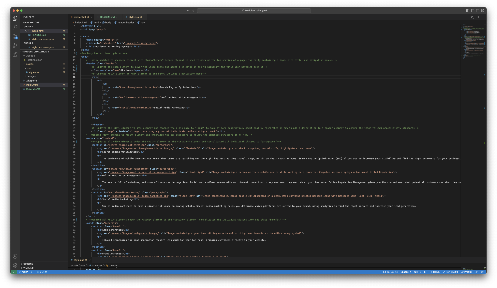

# <Horiseon Marketing Agency>

## Description

The refractoring of this project was essential for my client (Horiseon Marketing Agency) as their current webpage lacked various accessibility features. I built this project to ensure that the webpage meet all accessibility standards and in the process cleaned up the current HTML file. The HTML file has now been updated with proper semantic structure which will improve the following: accessibility for users with disabilities, ease of refractoring in the future or maintenance to the code, and search engine optimization. During the project I had the opportunity to learn how to break down an HTML file and update the file with semantic structure. Additionally, I found that organizing the css style sheet to follow the HTML's semantic structure will make it easier to maintain the webpage when updates are needed. 

## Table of Contents

- [Installation](#installation)
- [Usage](#usage)
- [Credits](#credits)
- [License](#license)

## Installation

n/a

## Usage

To use this webpage you can direct your attention to the navigation bar where you can  click on any of the subjects and be directed to the description of each subject. Website has been updated for search engine optimization and accessibility. 

## Credits

Collaborators:
Learning Assist: Oscar
Ruben Ruiz

https://developer.mozilla.org/en-US/docs/Web/Accessibility/ARIA/Attributes/aria-label
https://github.com/microsoft/vscode
https://coding-boot-camp.github.io/full-stack/github/professional-readme-guide

## License

MIT License

Copyright (c) [2023] [HectorDelgado]

Permission is hereby granted, free of charge, to any person obtaining a copy
of this software and associated documentation files (the "Software"), to deal
in the Software without restriction, including without limitation the rights
to use, copy, modify, merge, publish, distribute, sublicense, and/or sell
copies of the Software, and to permit persons to whom the Software is
furnished to do so, subject to the following conditions:

The above copyright notice and this permission notice shall be included in all
copies or substantial portions of the Software.

THE SOFTWARE IS PROVIDED "AS IS", WITHOUT WARRANTY OF ANY KIND, EXPRESS OR
IMPLIED, INCLUDING BUT NOT LIMITED TO THE WARRANTIES OF MERCHANTABILITY,
FITNESS FOR A PARTICULAR PURPOSE AND NONINFRINGEMENT. IN NO EVENT SHALL THE
AUTHORS OR COPYRIGHT HOLDERS BE LIABLE FOR ANY CLAIM, DAMAGES OR OTHER
LIABILITY, WHETHER IN AN ACTION OF CONTRACT, TORT OR OTHERWISE, ARISING FROM,
OUT OF OR IN CONNECTION WITH THE SOFTWARE OR THE USE OR OTHER DEALINGS IN THE
SOFTWARE.
Copy license text to clipboard
Suggest this license
Make a pull request to suggest this license for a project that is not licensed. Please be polite: see if a license has already been suggested, try to suggest a license fitting for the project’s community, and keep your communication with project maintainers friendly.

Enter GitHub repository URL
How to apply this license
Create a text file (typically named LICENSE or LICENSE.txt) in the root of your source code and copy the text of the license into the file. Replace [year] with the current year and [fullname] with the name (or names) of the copyright holders.

Optional steps
Add MIT to your project’s package description, if applicable (e.g., Node.js, Ruby, and Rust). This will ensure the license is displayed in package directories.

 Source
Who’s using this license?
Babel
.NET
Rails

## Badges

Badges aren't necessary, but they demonstrate street cred. Badges let other developers know that you know what you're doing. Check out the badges hosted by [shields.io](https://shields.io/). You may not understand what they all represent now, but you will in time.

## Features

Project includes a span element to highlight the title of the webpage. <h1>Horiseon</h1>
Included alt attribute to images to improve accessibility functions. 
